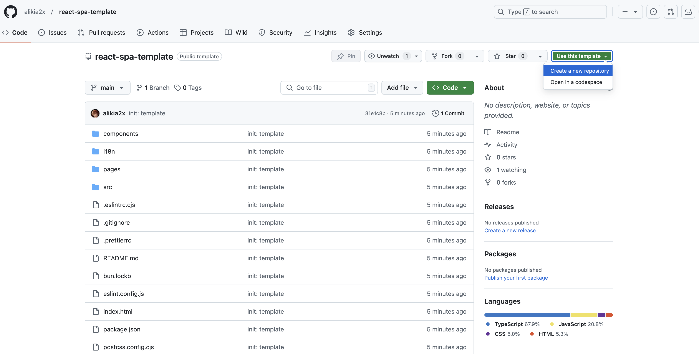

# React SPA Template

This template provides a setup to get React SPA app, with following features supported: 

- Routing: React Router - Hash route
- Styling: Tailwind CSS
- i18n: react-i18next
- Framework: React
- Building: Vite
- Linting: ESLint
- Formating: Prettier
- Pacakage manager: Bun

## Getting Started

You can start a project using this template by clicking the “Use this template” button on GitHub, as shown in the image below.

